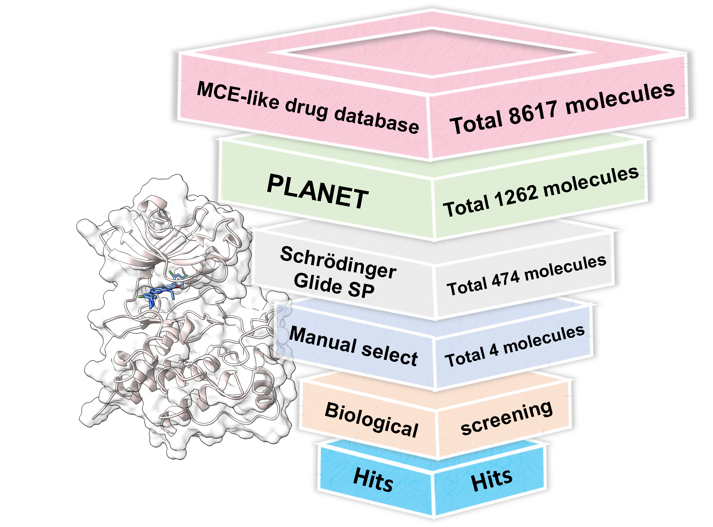

# Discovery_of_LCK_Inhibitors
This repository contains key files and data for the article "Discovery of A Novel and Potent LCK Inhibitor for Leukemia Treatment via Deep Learning and Molecular Docking". Our work focused on finding new ligands for lymphocyte-specific protein tyrosine kinase (LCK). 

## Docking Model Validation
### Data collection and clustering
- **Data collection**: For gathering the necessary data, we utilized a custom script named `Chembl_PDB_download.py (+ids.csv)`. This script is responsible for downloading active compound data from the ChEMBL database, filtering based on specific criteria, and preparing the data for subsequent analysis. It leverages libraries such as pandas, Chembl webresource client, and RDKit to handle chemical informatics tasks efficiently. The detailed procedure includes querying target compounds by Uniprot IDs, cleaning the retrieved SMILES strings, and downloading corresponding PDB files if available.
- **Data clustering**: To analyze the collected data effectively, we employed a script called `cluster.py`. This script reads an Excel file containing SMILES strings of molecules, calculates their molecular fingerprints using RDKit, and performs clustering based on the Tanimoto similarity of these fingerprints. The clustering is achieved through agglomerative hierarchical clustering, aiming to group compounds into 50 clusters. This step facilitates the identification of structurally similar compounds, enabling focused analysis and comparison within each cluster.
### Generation of Decoy Compounds and Statistical Analysis

### AutoDock-GPU
***
3. 
