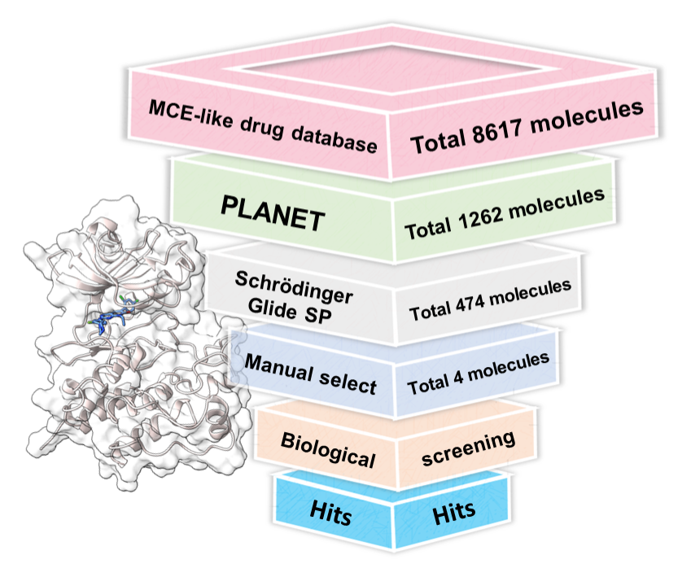

# Discovery_of_LCK_Inhibitors
 This repository contains key files and data for the article "Discovery of A Novel and Potent LCK Inhibitor for Leukemia Treatment via Deep Learning and Molecular Docking". Our work focused on finding new ligands for lymphocyte-specific protein tyrosine kinase (LCK), vital for T-cell development and activation. 

***
#Docking Model Validation
    ##Data collection and clustering
    ##Generation of Decoy Compounds and Statistical Analysis
    ##AutoDock-GPU
***
3. 
